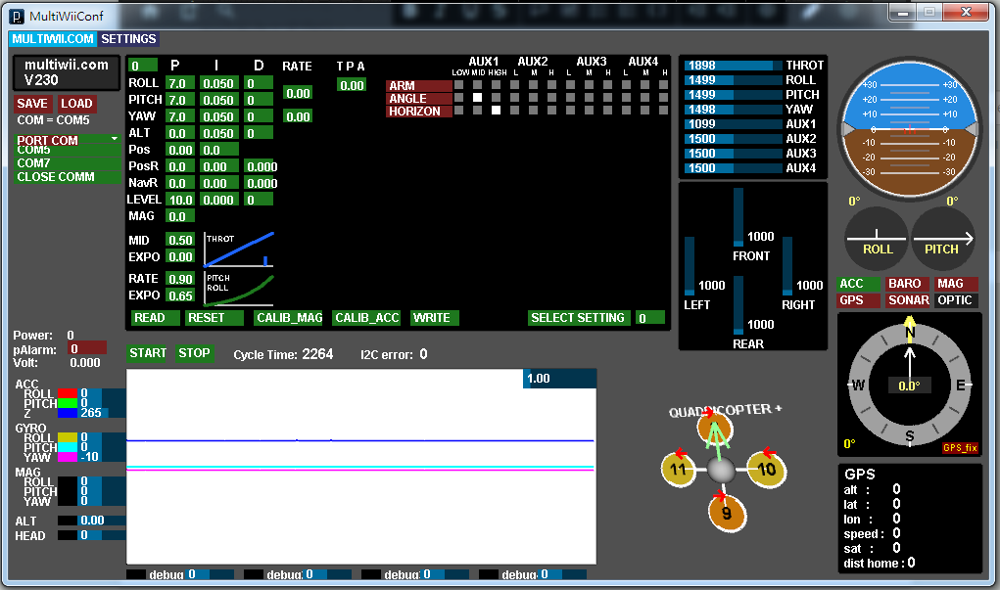

# Multiwii移植Pico

### 預估進度
- [ ] 文本翻譯(設置頁面已完成)
- [ ] 不必要功能刪減(遙控器,額外兼容的設置)
- [ ] 第一版可於Arduino-PICO編譯代碼
- [ ] 功能測試
- [ ] GUI開發移植 計畫採用web方式發布(Web Serial API)

- [ ] BLE遙控器控制
- [ ] Android開發

### 已知問題
- 官方網站已經404<https://www.multiwii.com/>

- Github代碼以年久許多要更新
- GUI介面不兼容Win11

### install Arduino-pico
```
https://github.com/earlephilhower/arduino-pico/releases/download/global/package_rp2040_index.json
```
### 參考資料

https://arduino-pico.readthedocs.io/en/latest/index.html

https://en.wikipedia.org/wiki/RP2040

